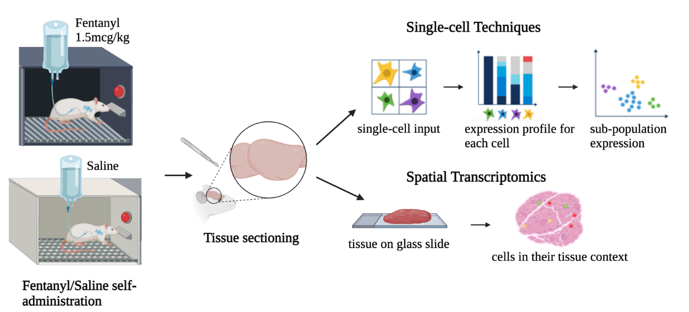

# Single Cell Multiomics Analysis on Rat Brain following Fentanyl Self-Administration 



## Introduction 
This repository includes SnRNAseq and SnATACseq analysis pipeline on the rat midbrain after fentanyl self-administration. This includes the data processing (fastqc, cellranger) and the following downstream analysis: 
* QC metrics 
* Cell type annotation (MultiVI) 
* Cell proportions (scCODA) 
* Cell specific differentially expressed genes and peaks (Limma) 
* Cell-cell communication (scDiffCom)
* Multimodal integration (DIABLO)
* Spatial data analysis for validation (CosMx) 

## Reproducibility 
In order to reproduce our analysis, we have created docker images for certain downstream steps. Follow the steps below to build the docker image locally or through UBC ARC Sockeye. 

### Local 
- create docker image and run container
```
make build
make run
```

- run fastqc in running docker container
```
cd fastqc
make fastqc
```

- push image to DockerHub
* make sure you have a dockerhub account
```
make push
```

### Sockeye

#### clone repo to hpc project folder
- log into sockeye and go to project user folder

```bash
module load git
git clone https://github.com/rishikadaswani/snrnaseq
```

#### pull docker image

```bash
cd fastqc
make sockeye_pull
```
